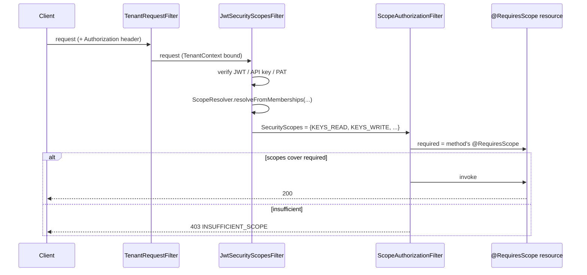

# Authorization — scopes and roles

Translately uses a **scope-based authorization model** layered on top of coarse **organization roles**. Scopes are the atomic permission token; roles are the human-facing shorthand that maps to a curated scope set.

Introduced by: [T108](https://github.com/Pratiyush/translately/issues/133) (scope enum + `@RequiresScope` + JAX-RS filter), [T109](https://github.com/Pratiyush/translately/issues/134) (role → scope resolver).

Related docs: [auth architecture](auth.md), [API scopes reference](../api/scopes.md).

## Scope naming

Every scope is a dotted, lowercase token: `<domain>.<action>` where `<action>` ∈ `{read, write}` plus the special `ai.suggest`.

- `write` **implies** `read` at the resolver level — a caller with `keys.write` passes a `keys.read` check.
- **Never rename an existing token.** API keys, PATs, and customer-issued credentials embed these strings in storage. Add a new scope and deprecate the old one; remove one minor version later.

The full catalogue lives in [`io.translately.security.Scope`](../../backend/security/src/main/kotlin/io/translately/security/Scope.kt) and is surfaced in the [API scopes reference](../api/scopes.md).

## Role → scope mapping

The three built-in organization roles are deliberately coarse. Finer-grained rules (per-project roles, API-key scope intersection, PAT restriction) compose on top.

| Role | Read scopes | Write scopes | Notes |
|---|---|---|---|
| **OWNER** | every `*.read` | every `*.write` + `ai.suggest` + `audit.read` | Founder / destructive rights. New scopes default to OWNER so we never forget to grant them. |
| **ADMIN** | every `*.read` | OWNER minus `project-settings.write`, `ai-config.write`, `api-keys.write` | Can manage members and projects but cannot rename/archive projects, rotate BYOK keys, or mint org API keys. Retains `audit.read` so admins cannot hide their own tracks by rotating their credentials. |
| **MEMBER** | every `*.read` | `keys.write`, `translations.write`, `imports.write`, `ai.suggest` | "Day-job" authoring set. Cannot administer the org or configure project-wide toggles. |

Invariant: `OWNER ⊃ ADMIN ⊃ MEMBER`. Asserted by `OrgRoleScopesTest` — must be preserved as scopes are added.

### Why this specific ADMIN exclusion list?

Three levers stay with OWNER:

1. **`project-settings.write`** — rename / archive / delete a project. These are org-reshape actions.
2. **`ai-config.write`** — attach or rotate a BYOK AI provider. Owners control billing-adjacent decisions because BYOK keys have a cost.
3. **`api-keys.write`** — mint or revoke org-level API keys. Kept with OWNER so an ADMIN can't mint themselves a long-lived credential and drop it outside the audit horizon.

ADMIN explicitly keeps `audit.read` — separation so admins can investigate incidents without being able to cover up their own traces.

## Runtime resolution



The filters in code:

- [`TenantRequestFilter`](../../backend/api/src/main/kotlin/io/translately/api/tenant/TenantRequestFilter.kt) — runs first. Extracts the tenant identifier from the URL path.
- `JwtSecurityScopesFilter` — runs at `Priorities.AUTHENTICATION`. Verifies the credential, hydrates `SecurityScopes` with the resolved scope set.
- [`ScopeAuthorizationFilter`](../../backend/api/src/main/kotlin/io/translately/api/security/ScopeAuthorizationFilter.kt) — runs at `Priorities.AUTHORIZATION`. Reads `@RequiresScope` off the resource method; fails fast with `INSUFFICIENT_SCOPE` if the request doesn't cover it.

## `@RequiresScope` usage

```kotlin
@Path("/api/v1/organizations/{orgId}/projects")
class ProjectResource {

    @GET
    @RequiresScope(Scope.PROJECTS_READ)
    fun list(@PathParam("orgId") orgId: String): List<ProjectSummary> = ...

    @POST
    @RequiresScope(Scope.PROJECTS_WRITE, Scope.PROJECT_SETTINGS_WRITE)
    fun create(body: CreateProjectRequest): ProjectDto = ...
}
```

Multiple scopes in `@RequiresScope` are an **AND** — the caller must hold all of them. Document the `OR` case explicitly in the resource if you need it; don't overload the annotation.

`@RequiresScope` is only valid on JAX-RS resource methods (or the class, in which case it applies to every method). See the [`RequiresScope.kt`](../../backend/security/src/main/kotlin/io/translately/security/RequiresScope.kt) annotation and [`ScopeAuthorizationFilter.kt`](../../backend/api/src/main/kotlin/io/translately/api/security/ScopeAuthorizationFilter.kt) enforcer.

## Error contract

On failure the filter throws `InsufficientScopeException`, caught by `InsufficientScopeExceptionMapper` and serialized as:

```json
{
  "error": {
    "code": "INSUFFICIENT_SCOPE",
    "message": "This endpoint requires scope(s): keys.write",
    "details": { "required": ["keys.write"], "held": ["keys.read"] }
  }
}
```

HTTP status: `403`. Stable across minor versions — CLI, SDK, and webapp all match on `error.code`.

## Where roles meet scopes

`ScopeResolver.canResolveFor(userId, memberships, orgId)`:

- `orgId = null` — "cross-org view" (e.g. `GET /organizations` to list orgs you can see). Returns the union of every role across every org.
- `orgId ≠ null` — filter memberships by that org, then union. A user with no membership in the org receives the empty set → every downstream `@RequiresScope` fails closed.

The resolver is intentionally stateless and pure — no DB, no cache. The service layer loads memberships once (at JWT mint or per-request authentication) and passes them in. Cache invalidation is therefore not a problem this layer solves.
