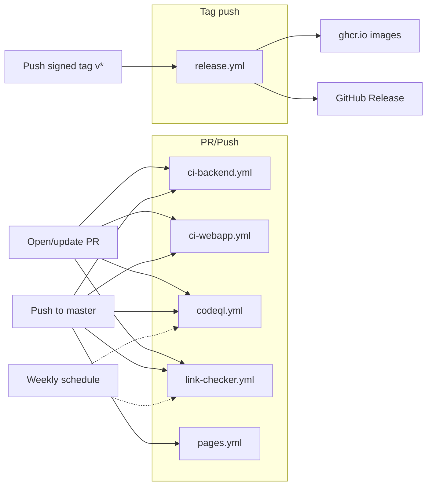

# CI pipelines

Translately's GitHub Actions live under [`.github/workflows/`](https://github.com/Pratiyush/translately/tree/master/.github/workflows). Six workflows handle PR validation, security scanning, link health, docs deploy, and signed-tag releases. Together with the `master` branch-protection rules, they form the full quality gate between a PR and a signed release tag.

## Workflow map

## Branch protection (master)

The workflows sit alongside branch-protection rules on `master`. Both together are the gate. Current settings (verify in repo settings or `gh api repos/Pratiyush/translately/branches/master/protection`):

- **Required signed commits.** Unsigned commits are rejected — no `--no-verify`, ever. CLAUDE.md rule #1 is mirrored as server-side enforcement.
- **Required linear history.** No merge commits on `master`; PRs merge via squash or rebase.
- **Required CODEOWNERS review.** Every matching path in [`CODEOWNERS`](https://github.com/Pratiyush/translately/blob/master/CODEOWNERS) pulls `@Pratiyush` in as a required reviewer.
- **Dismiss stale reviews on new commits.** Re-review required after any push.
- **Required conversation resolution.** Every review thread must be resolved before merge.
- **No force-push, no branch deletion.** Masters stays append-only.

CI workflows below are listed as required status checks — a red check blocks the merge button.

## `ci-backend.yml` — backend build + test

[File](https://github.com/Pratiyush/translately/blob/master/.github/workflows/ci-backend.yml). Owns JVM build, lint, test, coverage for the Gradle multi-module backend.

**Triggers:** `push` to `master` and every `pull_request`, filtered to paths under `backend/**`, `buildSrc/**`, `gradle/**`, the top-level Gradle files, or this workflow itself. Unrelated docs-only PRs don't spin it up.

**Concurrency:** `ci-backend-${{ github.ref }}` with `cancel-in-progress: true` — a fresh push supersedes the previous run.

**Permissions:** `contents: read`.

**Key steps:**

1. `actions/checkout@v4`.
2. `actions/setup-java@v4` — Temurin JDK **21**.
3. `gradle/actions/setup-gradle@v4` with cache cleanup.
4. `./gradlew projects --no-daemon` — sanity-check the 13-module wiring before spending time on anything heavier.
5. `./gradlew ktlintCheck detekt --no-daemon --continue` — ktlint + detekt (`--continue` so both lint reports emit even if one fails).
6. `./gradlew build --no-daemon --stacktrace` — compile, test, Jacoco coverage, archive.
7. `./gradlew jacocoTestReport --no-daemon` (always) — regenerates the HTML report even when tests fail.
8. Upload **`backend-coverage`** and **`backend-test-reports`** artifacts (14-day retention).

The `checkOpenApiUpToDate` Gradle task (wired into `build` via `check` in [`buildSrc/.../quarkus-app`](https://github.com/Pratiyush/translately/blob/master/backend/app/build.gradle.kts)) fails the job if the committed `docs/api/openapi.json` drifts from what the backend emits — this is how API-spec docs stay in sync with code on every PR.

**Required secrets:** none.

## `ci-webapp.yml` — webapp lint + test + build

[File](https://github.com/Pratiyush/translately/blob/master/.github/workflows/ci-webapp.yml). Handles pnpm-based build for `webapp/`.

**Triggers:** push to `master` / any PR, filtered to `webapp/**`, `pnpm-workspace.yaml`, `package.json`, `pnpm-lock.yaml`, or this workflow file.

**Concurrency:** `ci-webapp-${{ github.ref }}` with cancel-in-progress.

**Guard job (`guard`):** checks for `webapp/package.json` and outputs `present=true|false`. The build job is skipped when the webapp hasn't been scaffolded yet — this was important in early Phase 0 before the webapp existed, and it's still the defensive pattern if the tree is ever reshaped.

**Build job key steps:**

1. Checkout.
2. `pnpm/action-setup@v4` + `actions/setup-node@v4` (Node **22**, pnpm cache enabled).
3. `pnpm install --frozen-lockfile` — lockfile drift fails the job.
4. `pnpm --filter @translately/webapp lint` — ESLint + Prettier.
5. `pnpm --filter @translately/webapp codegen:check` — regenerates `src/lib/api/types.gen.ts` from the committed `docs/api/openapi.json` and fails if the output drifts. Mirrors the backend's `checkOpenApiUpToDate` so the generated TypeScript client stays pinned to the spec.
6. `pnpm --filter @translately/webapp test -- --run` — Vitest.
7. `pnpm --filter @translately/webapp build` — Vite production bundle.
8. Upload `webapp-bundle` artifact (`webapp/dist/`, 14-day retention).

**Required secrets:** none.

## `codeql.yml` — SAST across three languages

[File](https://github.com/Pratiyush/translately/blob/master/.github/workflows/codeql.yml). GitHub CodeQL static analysis with the `security-and-quality` query pack.

**Triggers:**

- `push` to `master`.
- `pull_request` targeting `master`.
- Scheduled: every **Tuesday 03:17 UTC** (catches new CodeQL rules without waiting for the next PR).

**Permissions:** `actions: read`, `contents: read`, `security-events: write` (so findings upload to the Security tab).

**Detect job:** probes for the presence of any JS/TS source root (`webapp/`, `sdks/js/`, `sdks/react/`, `cli/`). Sets `has_jsts=true|false`. CodeQL's JS/TS extractor errors out with "no source" if it's pointed at an empty tree, so we skip it until there's something to scan.

**Analyze matrix:**

| Language | Build mode | Notes |
|---|---|---|
| `java-kotlin` | `autobuild` | Uses the Gradle wrapper. Temurin JDK 21 set up before init. |
| `javascript-typescript` | `none` | Gated on `has_jsts=true`. No build step needed — parses source directly. |
| `actions` | `none` | Scans the workflow YAML itself for action misuse / pinning issues. |

Each matrix leg runs the standard `codeql-action/init@v3` → `codeql-action/analyze@v3` pair with `queries: security-and-quality`.

Timeout: 30 minutes. `fail-fast: false` so one language failing doesn't mask the others.

**Required secrets:** none (uses the default `GITHUB_TOKEN`).

## `link-checker.yml` — lychee

[File](https://github.com/Pratiyush/translately/blob/master/.github/workflows/link-checker.yml). Runs [lychee](https://github.com/lycheeverse/lychee-action) over every Markdown file and the built `docs/**/*.html` to catch link rot.

**Triggers:**

- Push / PR on `**/*.md`, anything under `docs/`, or this workflow file.
- Scheduled: **every Monday 06:13 UTC**.

Config: [`lychee.toml`](https://github.com/Pratiyush/translately/blob/master/lychee.toml) at the repo root. Notable bits:

- `exclude_path = ["_reference"]` — skip the gitignored third-party mirror.
- A list of known-future URLs (release tags that 404 until their tag lands, the Pages site during first-deploy cache, the docs-bundle ZIP that's built inside `pages.yml` rather than committed) is excluded so link-rot remains actionable.
- `accept = [200, 202, 206, 301, 302, 303, 307, 308, 403, 429]` — common redirect/throttle codes count as healthy.

**Key steps:**

1. Checkout.
2. `lycheeverse/lychee-action@v2` with `--config lychee.toml './**/*.md' 'docs/**/*.html'`, `fail: true`.
3. Always upload the `lychee-report.md` artifact (14-day retention).

**Permissions:** `contents: read`, `issues: write` (some lychee integrations can auto-open issues; we don't currently wire that on).

**Required secrets:** none.

## `pages.yml` — GitHub Pages deploy (docs site)

[File](https://github.com/Pratiyush/translately/blob/master/.github/workflows/pages.yml). Builds the Jekyll site under `docs/` with the `just-the-docs` remote theme and publishes it to GitHub Pages.

**Triggers:**

- `push` to `master` on `docs/**` or this workflow file.
- `workflow_dispatch` — manual re-deploy without a content change.

**Permissions:** `contents: read`, `pages: write`, `id-token: write` (required by `actions/deploy-pages`).

**Concurrency:** `group: pages`, `cancel-in-progress: true` — a newer deploy cancels an in-flight one.

**Two jobs:**

1. **`build`** (runs on `ubuntu-latest`):
   - Checkout.
   - Build the **downloadable docs bundle**: `docs/downloads/translately-docs.zip` containing every raw `.md` / `.txt` / image under `docs/` so offline users can consume the full corpus without cloning. Built **before** Jekyll so it ends up inside `_site`.
   - `actions/configure-pages@v5`.
   - `actions/jekyll-build-pages@v1` with `source: ./docs`, `destination: ./_site`.
   - `actions/upload-pages-artifact@v3`.

2. **`deploy`** (depends on `build`):
   - `actions/deploy-pages@v4` → <https://pratiyush.github.io/translately/>.
   - Environment: `github-pages` (enforces the Pages-specific OIDC token).

**Required secrets:** none — GitHub-managed Pages tokens only.

## `release.yml` — signed-tag pipeline

[File](https://github.com/Pratiyush/translately/blob/master/.github/workflows/release.yml). The big one. Fires only when a `v*` tag is pushed.

**Trigger:** `push` with `tags: ['v*']`. Per the phase gate in [CLAUDE.md rule #6](https://github.com/Pratiyush/translately/blob/master/CLAUDE.md), Phase N ends with a signed tag `v0.N.0`; `v1.0.0` is Phase 7.

**Permissions:** `contents: write` (for the Release), `packages: write` (GHCR push), `id-token: write` (Cosign keyless).

**Concurrency:** `release-${{ github.ref }}`, **not cancel-in-progress** — releases run to completion.

**Jobs:**

### `verify` — signed tag + version extraction

- Extracts `VERSION="${TAG#v}"`.
- Flags `is_prerelease=true` when `VERSION` starts with `0.` (all Phase 0–7 tags are pre-1.0).
- `git tag -v` checks GPG signature. Currently a soft warning on CI (the ephemeral runner may not have the pubkey imported) — branch protection on `master` is the real enforcement that unsigned commits / tags can't land.

### `build-backend`

- Temurin JDK 21 + Gradle.
- `./gradlew :backend:app:build -x test -x checkOpenApiUpToDate --no-daemon` — builds the Quarkus **fast-jar**, skipping `test` and `checkOpenApiUpToDate` because both depend on a boot-time Quarkus test-mode run that PR-time CI has already enforced.
- Uploads `backend-fastjar-${VERSION}` artifact (30-day retention).

### `build-webapp`

- Guard-checks for `webapp/package.json` first (mirrors `ci-webapp.yml`).
- pnpm install + `pnpm --filter @translately/webapp build`.
- Uploads `webapp-bundle-${VERSION}` artifact (30-day retention).

### `docker` — multi-arch image build + push + sign

Depends on `verify`, `build-backend`, `build-webapp`. Skipped for `0.0.1` bootstraps (`if: needs.verify.outputs.version != '0.0.1'`).

- `docker/setup-qemu-action@v3` + `docker/setup-buildx-action@v3`.
- Log in to `ghcr.io` with the job's `GITHUB_TOKEN`.
- **Backend image:** `docker/build-push-action@v6` with `infra/docker/backend.Dockerfile`, platforms `linux/amd64,linux/arm64`, `provenance: mode=max`, `sbom: true`.
- **Webapp image:** same, conditional on `hashFiles('webapp/package.json') != ''`.
- Tags pushed: `ghcr.io/pratiyush/translately-{backend,webapp}:${VERSION}` and `:latest`.
- OCI labels pinned: `image.source`, `image.revision`, `image.version`, `image.licenses=MIT`.
- `sigstore/cosign-installer@v3` + `cosign sign` (keyless, `COSIGN_YES=true`) — signatures verifiable from the image tag alone.

**Required secrets:** none (GHCR uses `GITHUB_TOKEN`; Cosign is OIDC/keyless via `id-token: write`).

### `release` — GitHub Release creation

- `fetch-depth: 0` so the CHANGELOG awk scrape can read history.
- Extracts the `## [${VERSION}]` section from `CHANGELOG.md` with `awk`; falls back to a stub.
- Downloads the backend + webapp artifacts and `tar -czf`'s them into `translately-backend-${VERSION}.tar.gz` / `translately-webapp-${VERSION}.tar.gz`.
- `softprops/action-gh-release@v2` creates or updates the Release, attaches both tarballs, and flags pre-release based on the `verify` output.

## How the workflows compose

- **Every PR** runs `ci-backend`, `ci-webapp` (when webapp paths changed), `codeql`, and `link-checker` (for Markdown/docs changes). All four must be green; CODEOWNERS approval + signed commits are required; linear history is enforced on merge.
- **Push to `master`** re-runs the same four and additionally deploys `docs/` via `pages.yml` when the docs tree changes.
- **Signed `v*` tag push** triggers `release.yml` — builds fast-jar + webapp bundle, publishes signed multi-arch images to GHCR, and creates the GitHub Release with CHANGELOG-sourced notes.
- **Scheduled runs** — CodeQL weekly (Tue 03:17 UTC) catches new rule updates; lychee weekly (Mon 06:13 UTC) catches external link rot that a code-free week would miss.

For the contributor-facing workflow that sits on top of these pipelines (branch naming, commit conventions, pre-merge checklist), see [`.kiro/steering/contributing-rules.md`](https://github.com/Pratiyush/translately/blob/master/.kiro/steering/contributing-rules.md) and the [pull-request template](https://github.com/Pratiyush/translately/blob/master/.github/PULL_REQUEST_TEMPLATE.md).
