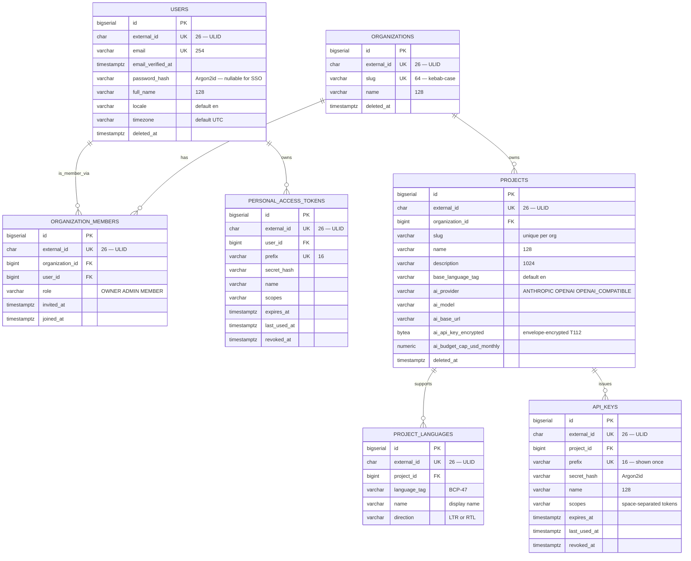

# Data model

Translately's persistence layer is PostgreSQL 16 with Hibernate ORM + Panache (blocking JDBC). Schema evolution is driven by Flyway, plain-SQL migrations under [`backend/data/src/main/resources/db/migration/`](../../backend/data/src/main/resources/db/migration/). This page is the narrative partner of `V1__auth_and_orgs.sql` — start here for the **why** and jump to the migration for the **how**.

Introduced by: [T101](https://github.com/Pratiyush/translately/issues/129) · First migration: `V1__auth_and_orgs.sql`.

## Identifier strategy

Every durable entity carries **two** identifiers:

- `id BIGSERIAL PRIMARY KEY` — monotonic, internal only. Foreign keys reference this.
- `external_id CHAR(26) NOT NULL UNIQUE` — [ULID](https://github.com/ulid/spec), Crockford base32, lexicographically time-sortable. This is the only identifier that leaves the database: every URL, JSON payload, webhook event, and API-key prefix uses `external_id`.

**Why both.** Using a bigserial for FKs keeps indexes tiny and joins fast; exposing ULIDs on the wire avoids leaking row counts, dodges integer-enumeration attacks, and lets callers sort by ID as a coarse creation-time sort.

Generation lives in [`io.translately.data.Ulid`](../../backend/data/src/main/kotlin/io/translately/data/Ulid.kt); a Hibernate `@PrePersist` hook assigns it if the entity is persisted without one.

## Conventions

| Convention | Rule |
|---|---|
| Table names | plural snake_case (`users`, `project_languages`) |
| Timestamps | `created_at`, `updated_at`, optional `deleted_at` — all `TIMESTAMPTZ NOT NULL` (`deleted_at` nullable) |
| Soft delete | only where retention matters (users, organizations, projects). Everything else hard-deletes on cascade |
| FK naming | `fk_<child>_<parent>` |
| Unique constraints | `uk_<table>_<cols>` |
| Indexes | `idx_<table>_<cols>` |
| Booleans | avoided; prefer nullable `TIMESTAMPTZ` so we keep the "when" for free (`email_verified_at` vs. `email_verified`) |
| Enums | `VARCHAR(n)` + `CHECK` constraint — keeps migrations cheap and readable in psql |

## V1 entity-relationship diagram

## Notable per-entity decisions

### `users`

- `password_hash` is nullable — SSO-only users (Phase 7) do not have a local password. Login attempts with email + password against a null hash always fail on the same code path as "wrong password", so there is no enumeration signal.
- `email_verified_at` gates anything that isn't signup / verify / login / password-reset. Resource filters check this when T103's email-verify ships.
- `locale` and `timezone` are stored so server-rendered emails (Qute templates) and audit exports can respect the user's preferences without another round-trip.

### `organizations`

- `slug` is unique globally. A cheap sanity check — URLs are shorter and sharable when the slug is unique.
- No explicit billing fields: the platform is open-source self-host; SaaS operators fork and add billing tables on top.

### `organization_members`

- `(organization_id, user_id)` is UNIQUE — a user has exactly one role per org at any time.
- `invited_at` / `joined_at` split lets the service layer represent a pending invite without a separate table. A row with `joined_at IS NULL` is an outstanding invite.
- Roles are enforced by `CHECK (role IN ('OWNER','ADMIN','MEMBER'))` so bad enum values can't land even from a rogue INSERT.

### `projects`

- The five `ai_*` columns are all nullable — a project with zero AI columns set is perfectly functional; Suggest simply isn't offered in the UI. This is the schema shape that enforces CLAUDE.md's BYOK-optional rule.
- `ai_api_key_encrypted BYTEA` stores the envelope produced by [`CryptoService`](crypto.md) — never the plaintext API key.
- `(organization_id, slug)` is UNIQUE — slugs can collide across orgs, just not inside one.

### `api_keys` and `personal_access_tokens`

- Secrets are never stored. The 16-character `prefix` is shown once to the caller so we can disambiguate in the UI; the hash is Argon2id (see [auth architecture](auth.md)).
- `scopes` is a denormalized space-separated token list. A key with no scopes (`''`) can still be authenticated but will fail every scope-authorization check — a defensive default.
- `expires_at`, `last_used_at`, `revoked_at` together give the admin UI everything it needs to surface key health and mint / rotate confidently.

## Soft-delete policy

Only `users`, `organizations`, and `projects` soft-delete. Rationale: retention regulations (GDPR deletion requests, SOC2 audit history) push in opposite directions; we keep the row long enough that an undo is cheap and the audit trail intact, then periodically hard-delete.

Anything referenced via `FOREIGN KEY … ON DELETE CASCADE` hard-deletes automatically — that's the default for tokens, memberships, project-languages, api-keys, and PATs. A soft-deleted `users` row does *not* cascade: the service layer decides when to fully purge.

## Future migrations

Phase 2 (`V2__keys_translations_icu.sql`) introduces `keys`, `translations`, `namespaces`, `tags`, `comments`, `activities`. Phase 3 adds `import_jobs` / `export_jobs`. Phase 4 adds translation memory, budgets, per-provider audit rows. The ID and naming conventions above are inviolate across all of them.

See [`.kiro/steering/architecture.md`](../../.kiro/steering/architecture.md) for the operational guardrails (forward-only migrations, no destructive changes without a deprecation window).
