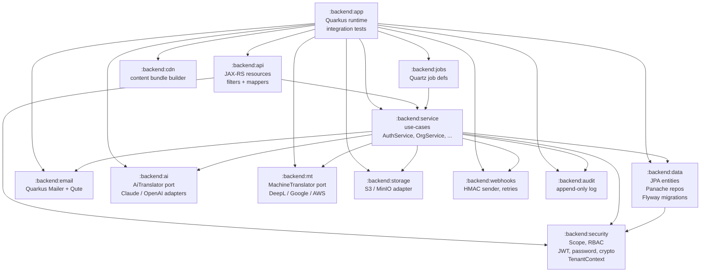

# Module map

Translately's backend is a single Gradle (Kotlin DSL) build with 13 modules under `:backend:*`. Each module is a narrow library; the single runnable artefact is `:backend:app`, which wires them into a Quarkus application.

Webapp and future CLI / SDK packages live outside the Gradle build in `webapp/`, `sdks/`, `cli/` and use their own tooling (pnpm, Vite, TypeScript).

## Module graph

*(Render via GitHub / Pages Mermaid support. A PNG export will land under `diagrams/` the first time someone edits this file in a content-rich PR.)*

## Ownership and rules

- **`:backend:security`** is a leaf library. It depends on no other `:backend:*` module. Keep it that way so every module — including `:data` — can use scopes, password hashing, crypto, and tenant context without circular dependencies. Enums that need to exist in both `:data` (as JPA entity state) and `:security` (as pure Kotlin) are duplicated — see `OrganizationRole` (data) vs `OrgRole` (security) with a test that asserts the name round-trip.
- **`:backend:data`** owns Flyway migrations and Panache entities. No service, filter, resource, or controller code lives here. Entities are plain data — they may carry `@PrePersist` / `@PreUpdate` for timestamp housekeeping but no business logic.
- **`:backend:service`** owns use-case orchestration. A service method is the transactional boundary (`@Transactional`) and is the only layer allowed to emit audit events or send email.
- **`:backend:api`** translates HTTP to services and back. Filters here are: `TenantRequestFilter` → authenticators → `ScopeAuthorizationFilter`. Exception mappers map `AuthException` / `InsufficientScopeException` to the uniform `{error:{code,message,details?}}` envelope.
- **`:backend:app`** is the only module with `quarkus-resteasy-reactive` at runtime scope. It wires CDI producers (`CryptoServiceProducer`, etc.), hosts the Quarkus test profile, and runs integration tests against Testcontainers Postgres + Mailpit.

## Why this shape

- **Boot time matters.** Smaller JARs → faster dev loop → faster CI. The hard rule that `:security` has no heavy deps lets unit tests in that module avoid starting Quarkus at all.
- **Testability.** Each leaf module is trivially unit-testable with MockK. Integration tests (`*IT`) live only in `:backend:app` and bring the full Quarkus + Testcontainers environment up; there is no "almost full" middle tier.
- **Clean replacement.** Adapters in `:ai`, `:mt`, `:storage`, `:webhooks`, `:cdn` implement a port interface defined in their own package. Adding a new provider is a new class in the same module — no other modules change.

See [`.kiro/steering/architecture.md`](https://github.com/Pratiyush/translately/blob/master/.kiro/steering/architecture.md) for the authoritative steering rule.
