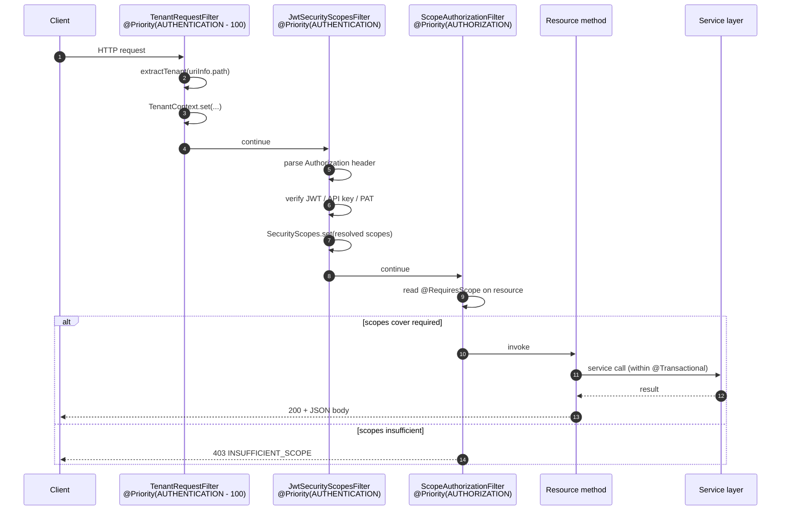

# Request lifecycle

A single Translately HTTP request flows through a fixed chain of JAX-RS filters before reaching the resource method, and a fixed chain of exception mappers on the way back. This page documents the order, the invariants each filter maintains, and the error envelope that leaves the server.

Introduced by: [T108](https://github.com/Pratiyush/translately/issues/133) (`@RequiresScope` + `ScopeAuthorizationFilter`), [T111](https://github.com/Pratiyush/translately/issues/135) (`TenantRequestFilter`), T103 (auth endpoints), T104 (JWT issuer).

Related: [auth architecture](auth.md), [authorization](authorization.md), [multi-tenancy](multi-tenancy.md), [API conventions](../../.kiro/steering/api-conventions.md).

## Filter chain (request side)



### Why this order

- **Tenant first.** Authenticators need to know the tenant to resolve project-scoped credentials (API keys, PATs).
- **Auth second.** The scope authorization filter relies on `SecurityScopes` populated by a successful authentication; without a credential, it cannot answer "does this caller have the required scope?".
- **Authorization third.** Deliberately last so all upstream context (tenant, principal, scopes) is available when the `@RequiresScope` check runs.

Priorities are JAX-RS numeric — lower runs earlier. `Priorities.AUTHENTICATION = 1000` and `Priorities.AUTHORIZATION = 2000` come from `jakarta.ws.rs.Priorities`; the tenant filter's `-100` offset guarantees it runs before any authenticator regardless of future additions.

## Resource → service → data

- Resource methods are thin: parse path / query / body, call the service, map the return value to a DTO. No transactions at this layer.
- Services are the transactional boundary. `@Transactional` annotates the public method; nested service calls run in the same transaction.
- Data access flows through Panache repositories. A single service method is free to issue multiple queries; Hibernate's first-level cache handles same-session identity.

## Exception mapping

Uncaught exceptions land in a JAX-RS `ExceptionMapper`. The standard mappings:

| Throwable | HTTP | Error envelope `code` | Mapper |
|---|---|---|---|
| `AuthException.InvalidCredentials` | 401 | `INVALID_CREDENTIALS` | `AuthExceptionMapper` |
| `AuthException.EmailNotVerified` | 403 | `EMAIL_NOT_VERIFIED` | ″ |
| `AuthException.RefreshTokenReused` | 401 | `REFRESH_TOKEN_REUSED` | ″ |
| `AuthException.ValidationFailed` | 400 | `VALIDATION_FAILED` | ″ |
| `InsufficientScopeException` | 403 | `INSUFFICIENT_SCOPE` | `InsufficientScopeExceptionMapper` |
| `NotFoundException` | 404 | `NOT_FOUND` | `NotFoundMapper` |
| `ConstraintViolationException` (Jakarta Validation) | 400 | `VALIDATION_FAILED` | `ConstraintViolationMapper` |
| `WebApplicationException` | pass-through | varies | default |
| anything else | 500 | `INTERNAL_ERROR` | `FallbackExceptionMapper` (logs stack, hides detail) |

Every response uses the uniform envelope:

```json
{
  "error": {
    "code": "ERROR_CODE",
    "message": "Human-readable summary",
    "details": { "optional": "extra context" }
  }
}
```

See [API errors reference](../api/errors.md) for the full catalogue of `code` strings.

## Observability hooks

- **Request ID** — Quarkus's default `x-request-id` propagates through the filter chain and lands in structured logs. If absent, the server generates one.
- **OpenTelemetry** — Quarkus OTel is enabled by default; the tenant identifier is added as a span attribute (`translately.tenant`) when bound.
- **Metrics** — Quarkus Micrometer exposes `/q/metrics` (Prometheus format). Every resource class gets `http.server.requests` counters with route + status labels.

## Cross-cutting tests

- `TenantRequestFilterIT` exercises the order: tenant must be bound before authenticators see `ContainerRequestContext`.
- `ScopeAuthorizationIT` covers every combination of present / missing scope and proves `INSUFFICIENT_SCOPE` wins over `NOT_FOUND` (we don't leak whether a resource exists).
- `AuthResourceIT` (T103) round-trips the full credential set against Testcontainers Postgres + Mailpit.

## When to add a new filter

Rarely. Today's chain is three links — keeping it small matters because every filter runs on every request. Before adding one, consider:

1. Can this live in a service instead?
2. Can this be an `ExceptionMapper` triggered by a thrown business exception?
3. If it really must be a filter, what priority relative to the existing three?

A new filter ships with a failing test that proves order (it must run before / after an existing one) and a line in this document.
