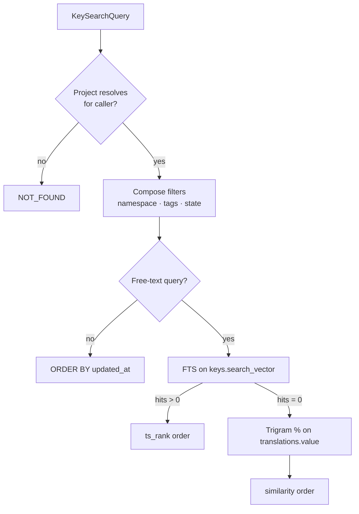

# Search

Translately searches keys and translations with Postgres's built-in full-text + trigram indexes — no Elasticsearch in v1. The steering doc ([`.kiro/steering/architecture.md`](https://github.com/Pratiyush/translately/blob/master/.kiro/steering/architecture.md)) declares the "no Elasticsearch" rule; this page records the how and why.

Introduced by: [T206](https://github.com/Pratiyush/translately/issues/47) · First migration: [`V4__keys_fts_trigram.sql`](https://github.com/Pratiyush/translately/blob/master/backend/data/src/main/resources/db/migration/V4__keys_fts_trigram.sql).

## Why Postgres, not Elasticsearch

Phase 2's search UX — a filter box over keys, optional tag / namespace / state chips, a few dozen results — is a cheap problem. Postgres 16 ships `tsvector` + GIN + `pg_trgm` in core; no separate service to boot, no secondary index to sync, no split-brain failure mode, no extra host or RAM to allocate. Self-hosters get search for free.

The escape hatch is live: if a deployment grows past a corpus Postgres handles gracefully (tens of millions of keys, complex multi-language stemming), wiring Elasticsearch or Meilisearch as a read-model is a Phase-8+ optimisation, not a v1 constraint.

## The index layout

`V4__keys_fts_trigram.sql` adds three artefacts on top of V3:

1. **`CREATE EXTENSION IF NOT EXISTS pg_trgm;`** — idempotent, ships with Postgres 16 core.
2. **`keys.search_vector`** — a generated `tsvector` column.
   ```sql
   ALTER TABLE keys
       ADD COLUMN search_vector tsvector
           GENERATED ALWAYS AS (
               to_tsvector(
                   'simple',
                   COALESCE(key_name, '') || ' ' ||
                   regexp_replace(COALESCE(key_name, ''), '[._-]+', ' ', 'g') || ' ' ||
                   COALESCE(description, '')
               )
           ) STORED;
   CREATE INDEX idx_keys_search_vector ON keys USING gin (search_vector);
   ```
   The `GENERATED ALWAYS ... STORED` shape keeps the vector in lock-step with `key_name` / `description` without a trigger or app-side bookkeeping. `key_name` is also included with `[._-]+` runs replaced by spaces so identifier-style names like `settings.save.button` produce the lexemes `settings`, `save`, `button` instead of being swallowed by the default parser's `host`-token rule.
3. **`translations.value` trigram GIN** —
   ```sql
   CREATE INDEX idx_translations_value_trgm
       ON translations USING gin (value gin_trgm_ops);
   ```
   Covers `ILIKE` and the `%` similarity operator for fuzzy substring matches over translated text.

## The text-search configuration: `simple` vs `english`

Every `to_tsvector(...)` call picks a configuration. V4 uses `'simple'` — no stemming, no language-specific stopwords.

Rationale:

- Translately is multilingual by design. A single configuration must work identically for `en`, `de`, `ja`, `fr`. An `english` config would stem "running" → "run" but leave German strings alone, biasing ranking against non-English corpora.
- Callers search for identifier-like strings — `login.button`, `settings.save.primary` — where stemming loses precision and merges unrelated tokens.
- `simple` is cheap and deterministic; upgrade paths stay open.

A future migration can introduce a per-column language-specific configuration (e.g. on a `translations.lang_config` generated column keyed off `language_tag`) if the UX calls for it. The generated-column approach keeps that change contained to a single `ALTER`.

## Query composition

`io.translately.service.keys.KeySearchService` composes the WHERE clauses from a `KeySearchQuery`. The primary path is FTS on the key side; when FTS finds no hits and a query string was supplied, the service falls through to a trigram similarity match on `translations.value`.



Filter rules:

- **Namespace** — single `namespace_id` equality; URL-safe kebab slug in, internal id at the boundary.
- **Tag intersection** — `key_tags` join with `HAVING COUNT(DISTINCT tag_id) = :required`, so every requested tag must be present.
- **State** — equality on `keys.state`; uses `idx_keys_state`.
- **Pagination** — `LIMIT :lim OFFSET :off`; stable order via the composite `(rank DESC, id ASC)` or `(updated_at DESC, id ASC)`.

## Ranking

- **FTS hits** return `ts_rank(search_vector, plainto_tsquery('simple', :q))` in `matchRank`. Higher is better; ~0.03–0.2 is typical for short corpora.
- **Trigram hits** use the `<%` word-similarity operator and return `MAX(word_similarity(:q, value))` — `[0, 1]`, higher is better. Word-similarity is better suited than raw `similarity()` for the "query appears as a word inside a longer translation body" shape the UI typically wants.
- **No-query browses** return `matchRank = 0f`.

A single `KeySearchHit` carries the entity + its rank so the API layer can expose the score if the UX wants to surface it.

## Membership gating

`search()` accepts a `callerExternalId` and requires org membership on the project. Non-members see `OrgException.NotFound("Project")` — the same shape as an unknown project, so the server never leaks project existence. Scope enforcement (e.g. `keys.read`) stays at the JAX-RS resource layer.

## Bench + smoke

The integration test [`backend/app/src/test/kotlin/io/translately/app/keys/KeySearchServiceIT.kt`](https://github.com/Pratiyush/translately/blob/master/backend/app/src/test/kotlin/io/translately/app/keys/KeySearchServiceIT.kt) seeds 10 keys / 3 tags / 7 translations and exercises every filter combination against a real Postgres container. No Postgres features are themselves tested — the goal is query composition, not PG correctness.

See also: [ADR 0003 — Postgres FTS over Elasticsearch for v1](decisions/0003-postgres-fts-over-elasticsearch.md).
