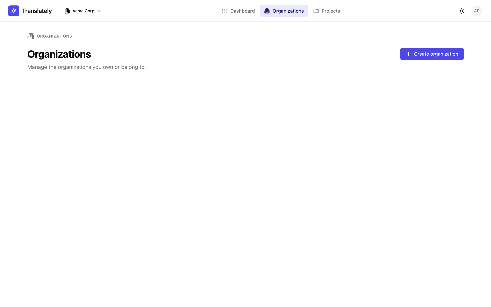
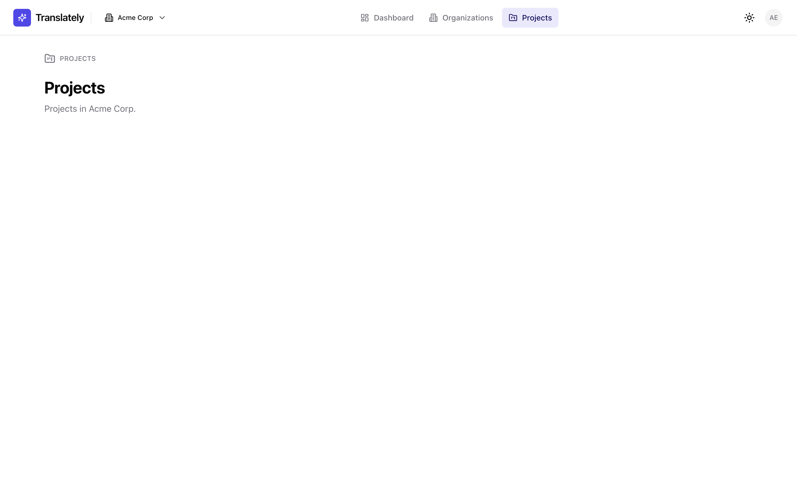

# Organizations, projects, and members

Real CRUD UI for managing who you collaborate with (organizations + members) and what you translate (projects). Shipped in v0.1.0 as T118 (orgs) and T119 (projects + member management). Pairs with the backend surface documented under [API reference → Organizations, projects, members](../api/organizations-and-projects.md).

## Routes

| Route | What it does |
|---|---|
| `/orgs` | Every organization the signed-in user belongs to, with a "Create organization" CTA. |
| `/orgs/:orgSlug` | Tabbed org detail: **Projects** (list + create), **Members** (role change + remove), **Settings** (rename). |
| `/projects` | At-a-glance project list for the currently active org (selected via the header `OrgSwitcher`). Empty until the user picks an org. |

Every page lives inside the authenticated shell — a visitor without a session is bounced through [`RequireAuth`](app-shell.md#requireauth) to `/signin`.

## `/orgs` — listing + create

- Shows a card per organization with name, slug, and the caller's role badge (`OWNER` / `ADMIN` / `MEMBER`).
- Empty state nudges first-time users to click **Create organization** — that's the only path onto the platform for someone who just verified their email.
- Card click → `/orgs/:slug` detail view.
- **Create dialog** (Radix modal, focus-trapped):
  - `name` is required (1..128 chars).
  - `slug` is optional; empty → server derives it from the name. Explicit slugs are validated client-side against the same kebab-case regex the backend uses.
  - 409 `ORG_SLUG_TAKEN` surfaces inline as a localised error ("That URL slug is already in use.").
  - Dialog closes on success and the list refreshes via TanStack Query invalidation.

<picture>
  <source srcset="screenshots/orgs-dark.png" media="(prefers-color-scheme: dark)">
  
</picture>

## `/orgs/:orgSlug` — tabbed detail

Tabs are a plain `role="tablist"` + `role="tabpanel"` pattern (no Radix needed) so keyboard users get Space / Enter to switch tabs without JS fanciness.

### Projects tab

- Grid of project cards (name, slug, description, base language tag).
- **Create project** dialog — same Radix modal shell as orgs:
  - `name` (required), `slug` (optional, kebab-case), `description` (optional), `baseLanguageTag` (BCP 47, defaults to `en`).
  - 409 `PROJECT_SLUG_TAKEN` → inline error.
  - `baseLanguageTag` is immutable after creation (Phase 2 adds migration).

### Members tab

- List of members with full name, email, join state (pending members show a "Pending" pill — invite flow lands in Phase 7 with SSO / SAML / LDAP).
- **Role** is an inline `<select>` — OWNER / ADMIN / MEMBER. Changes `PATCH /organizations/{orgSlug}/members/{userId}` immediately.
- **Remove** fires a confirm dialog ("Remove this member? They'll lose access to every project in this organization immediately.").
- **`LAST_OWNER` guard.** Both "demote the last OWNER" and "remove the last OWNER" return 409 `LAST_OWNER`; the UI surfaces that as "You can't remove or demote the last OWNER." The caller has to promote a co-owner first, then repeat the action.
- Own-row indicator: `(you)` tag next to the signed-in user's entry.

### Settings tab

- Single field: rename the organization.
- Posts `PATCH /organizations/{orgSlug}` with `{ name }`. Nothing else is editable in v0.1.0 (billing, AI config, etc. come in later phases).

## `/projects`

- Tenant-scoped: the active org comes from the header `OrgSwitcher`.
- No active org → explainer + CTA back to `/orgs`.
- Creation lives on `/orgs/:slug` — this page is an index, not a create surface. Links through on its empty state so users don't have to hunt for the button.

<picture>
  <source srcset="screenshots/projects-dark.png" media="(prefers-color-scheme: dark)">
  
</picture>

## Keyboard + accessibility

- All dialogs are Radix-based → `aria-modal`, focus trap, Esc-to-close, click-outside dismiss, focus returned to the trigger.
- Every dialog submit button has a `disabled` state tied to the mutation's pending flag; labels swap between "Create" and "Creating…" so screen readers announce progress.
- Role `<select>` has an invisible `<label>` (`Role for {email}`) per row so screen readers announce which row they're editing.
- Tabs use `role="tablist"` / `role="tab"` / `role="tabpanel"`; keyboard focus ring is the same ring used elsewhere in the shell.
- Confirm-to-remove dialog uses a title + description slot pair — both are announced on open.
- Colour contrast is the shell's token palette (WCAG 2.1 AA in both themes).

## Error-envelope mapping

Server errors come back in the uniform envelope (see [API errors](../api/errors.md)). The UI resolves `error.code` against `api.error.{CODE}` keys in `webapp/src/i18n/en.json`:

| `error.code` | UI string |
|---|---|
| `VALIDATION_FAILED` | "Please fix the highlighted fields." |
| `ORG_SLUG_TAKEN` | "That URL slug is already in use." |
| `PROJECT_SLUG_TAKEN` | "A project with that slug already exists in this organization." |
| `LAST_OWNER` | "You can't remove or demote the last OWNER." |
| `NOT_FOUND` | "Not found." |
| `UNAUTHENTICATED` | "Your session expired. Please sign in again." |

Unknown codes fall through to `error.message` from the envelope, then to a generic "Something went wrong" as a last resort.

## Testing notes

- `webapp/src/components/routes/OrgsRoute.test.tsx` covers empty-state, list-with-routes-to-detail, and the create-then-refresh round-trip (stubs `globalThis.fetch` for all three because the singleton `api` client reads it lazily).
- `webapp/src/lib/api/orgs.ts` is lint-clean and fully typed against `paths` from `docs/api/openapi.json` (no `any` or `unknown` leaks out of the module seam).
- Re-run the full webapp suite with `pnpm --filter webapp test`.

## Changelog

First shipped in [v0.1.0](../../CHANGELOG.md) under T118 (orgs UI) + T119 (projects + member management).
